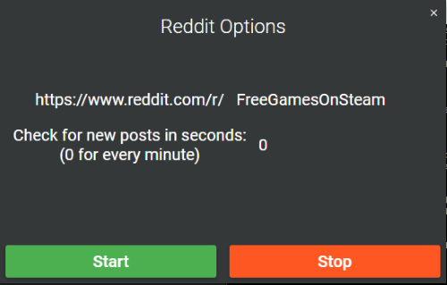
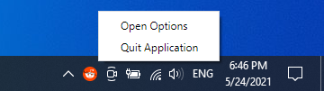

# Reddit Notifier

*App for getting notified when a new post is posted on a subreddit made in Electron and AngularJS.*


## Application Desing

### *Options Window*


Options window to start and stop the post searching. On *x* the application just goes to tray.

### *Notification Window*


Notification window which is showing the new subreddit post. On *x* closes the notification window, but does not stop running.

### *Tray Overview*


Application is constantly running in the tray. On double click the options window opens, and on right click more options are shown.

### *Tray Overview - Clicked*


When right clicked, the you can open the options window or quit the applicaiton.


## Other remarks

### How to start and build the project

- run ```npm install``` to install the necessary dependencies
- run ```npm run serve``` to start the app
- run ```npx electron-packager .``` to build the app